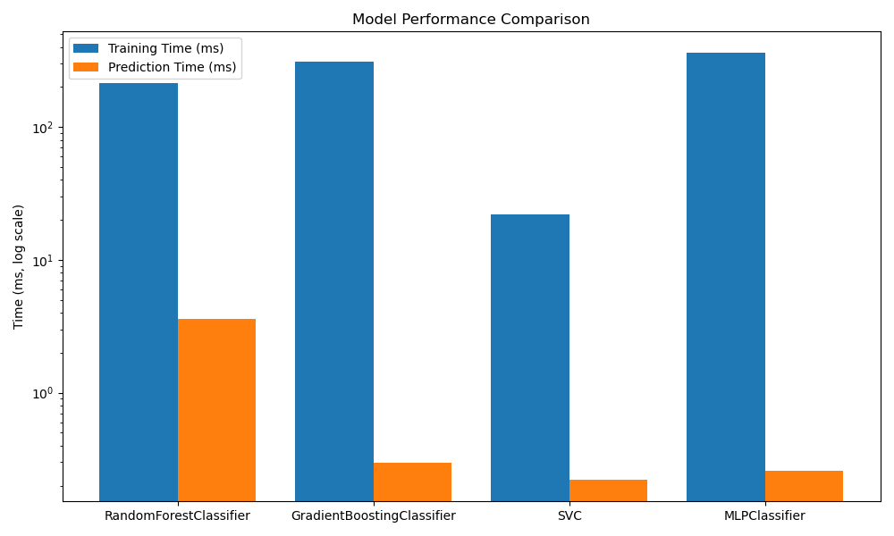

# Algorithm Performance Benchmark Report

## Overall Performance Metrics

- **Accuracy**: 0.97
- **Best Model**: SVM
- **Training Time**: 9.119428634643555 seconds
- **Original Features**: 10
- **Engineered Features**: 30

### Full Pipeline Benchmark

| Metric | Mean | Min | Max |
|--------|------|-----|------|
| Execution Time (s) | 10.526010513305664 | 9.120428800582886 | 11.931592226028442 |
| Memory Peak (MB) | 1.6397676467895508 | 1.5547676086425781 | 1.7247676849365234 |
| CPU Usage (%) | 27.541870921603348 | 25.274288149250495 | 29.8094536939562 |

## Component Benchmarks

### Feature Engineering

- **Mean**: 1.3475 ms
- **Min**: 1.3180 ms
- **Max**: 1.3883 ms

### Model Training Times

| Model | Mean (ms) | Min (ms) | Max (ms) |
|-------|-----------|----------|----------|
| RandomForestClassifier | 214.0183 | 212.2670 | 215.5075 |
| GradientBoostingClassifier | 308.9088 | 304.2517 | 313.3346 |
| SVC | 21.8268 | 21.3718 | 22.3064 |
| MLPClassifier | 360.7521 | 350.6501 | 394.8339 |

### Model Prediction Times

| Model | Mean (ms) | Min (ms) | Max (ms) |
|-------|-----------|----------|----------|
| RandomForestClassifier | 3.5819 | 3.4848 | 3.6966 |
| GradientBoostingClassifier | 0.2971 | 0.2906 | 0.3049 |
| SVC | 0.2199 | 0.2117 | 0.2275 |
| MLPClassifier | 0.2589 | 0.2487 | 0.2778 |

## Pytest Benchmark Results

|    | Name                                 |   Mean (ms) |   Min (ms) |   Max (ms) |   StdDev |   Rounds |
|---:|:-------------------------------------|------------:|-----------:|-----------:|---------:|---------:|
|  0 | test_feature_engineering_performance |      1.2911 |     1.1730 |     2.3629 |   0.1365 |      433 |
|  1 | test_model_predict_performance       |      0.2272 |     0.2027 |     0.7439 |   0.0379 |     1634 |
|  2 | test_full_pipeline_performance       |    103.7604 |   102.7838 |   105.7623 |   0.8650 |       10 |
|  3 | test_svm_training                    |     21.5008 |    20.6443 |    23.3320 |   0.4716 |       48 |
|  4 | test_rf_training                     |    214.7340 |   211.2023 |   218.7502 |   2.7655 |        5 |

## Conclusion

The best performing model was **SVM** with an accuracy of 0.97.

SVM trained **9.81x faster** than Random Forest, while achieving better accuracy, making it the preferred model for this dataset.
