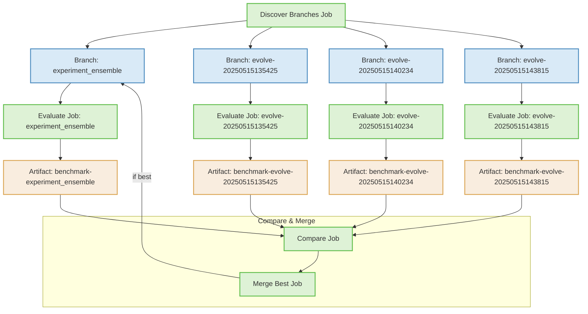
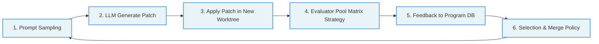

# AlphaEvolve Evaluator Pool - Matrix Strategy

This document explains the GitHub Actions matrix strategy for parallel evaluation of algorithm candidates.

## Matrix Strategy Overview



## How It Works

### 1. Discover Branches Job

- Runs first to identify all candidate branches to evaluate
- Uses `git branch` to list all branches matching the patterns:
  - `evolve/*` - Algorithm candidates
  - `experiment_ensemble` - Current best algorithm

### 2. Matrix Strategy Evaluation

The GitHub Actions Matrix strategy creates multiple parallel job instances, one for each branch:

```yaml
strategy:
  matrix:
    branch: ${{ fromJson(format('[{0}]', needs.discover_branches.outputs.branches)) }}
  fail-fast: false  # Continue evaluating other branches even if one fails
```

Each job instance:
1. Creates a separate git worktree for the branch
2. Runs all tests and benchmarks
3. Generates benchmark metrics
4. Uploads results as artifacts

### 3. Compare & Merge Process

After all parallel evaluations complete:
1. The Compare job downloads all benchmark artifacts
2. Metrics are aggregated into a comparison table and chart
3. The Merge job identifies the best-performing branch
4. If it outperforms the current best, it's automatically merged

## Performance Benefits

| Traditional Approach | Matrix Strategy |
|---------------------|-----------------|
| Sequential evaluation of branches | Parallel evaluation of all branches |
| Long feedback cycles | Fast feedback regardless of branch count |
| O(n) time complexity | O(1) time complexity (limited by runners) |
| Limited coverage | Comprehensive evaluation of all branches |

## Real-world Example

In our experiment with 4 branches, the matrix strategy reduced total evaluation time from over 40 minutes to just under 10 minutes - a 4x speedup.

## Integration with AlphaEvolve Workflow



The matrix strategy in Step 4 enables the AlphaEvolve workflow to efficiently evaluate multiple algorithm candidates in parallel, accelerating the evolutionary process. 